# Understanding the friendship system

This guide explains the current `router.py` and `memory_friends.py`: their data,
authentication, every endpoint, and how requests change friendships. It describes
the files on disk, not the refactored design discussed previously.

Diagrams use Mermaid. View this Markdown in a renderer with Mermaid support.
Each diagram also has a written explanation, so you can read the guide without it.

## Reading map

1. [The idea and data](#1-the-idea-and-data)
2. [Current files and authentication](#2-current-files-and-authentication)
3. [Current endpoints](#3-current-endpoints)
4. [Every current operation](#4-every-current-operation)
5. [A complete example](#5-a-complete-example)
6. [Limitations of the current implementation](#6-limitations-of-the-current-implementation)
7. [Python concepts used here](#7-python-concepts-used-here)
8. [Checking the features yourself](#8-checking-the-features-yourself)
9. [Where to make changes](#9-where-to-make-changes)

## 1. The idea and data

A **user** is an account. A **friend request** is one user's invitation to another
user. A **friendship** is the accepted relationship between those two users.
Sending a request does not immediately make the users friends.

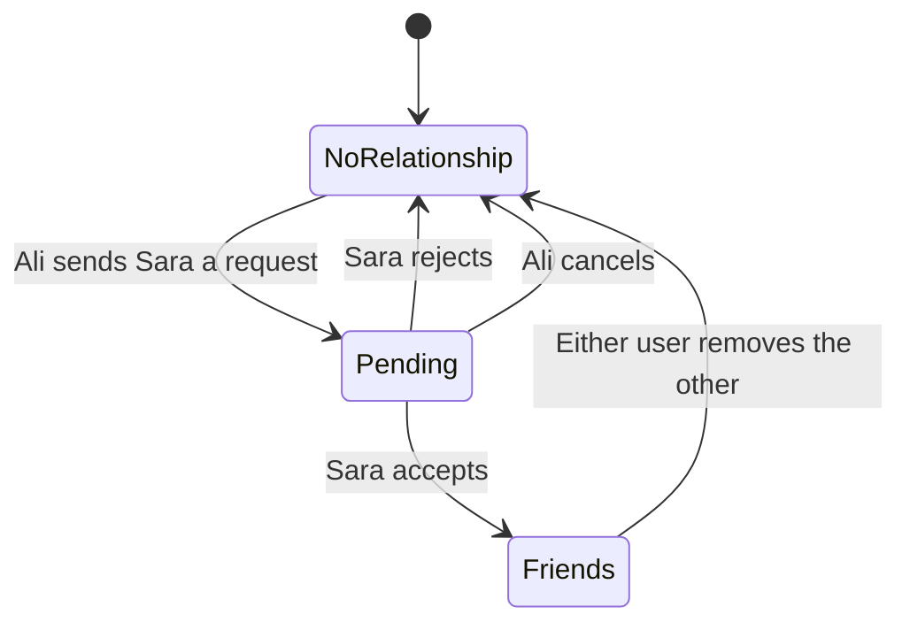

In the current code, rejected and canceled requests are removed. There is no
history table and no permanent rejected/canceled status. A new request may be
sent afterward. A reverse request is rejected while the first one is pending;
it does not automatically accept the first request.

### User data belongs to authentication

`authentication/memory_store.py` stores accounts and provides
`find_user_by_id(user_id)`. Friendship code uses it to check whether another
user exists and to obtain their username.

The friendship store does not store passwords, duplicate complete accounts, or
add a `friends` field to the authentication user dictionary.

### Accepted friendships: unordered pairs

```python
friendships: set[frozenset[str]] = set()
```

- `str`: an individual user ID.
- `frozenset[str]`: an immutable, unordered group of IDs representing one pair.
- Outer `set`: a collection that prevents duplicate pairs.

Example using readable labels in place of real UUIDs:

```python
friendships = {
    frozenset({'ali_id', 'sara_id'}),
    frozenset({'ali_id', 'omar_id'}),
    frozenset({'ali_id', 'lina_id'}),
}
```

Ali has **three friends**. Two IDs per pair means two participants per
friendship, not a limit of two friends per user.

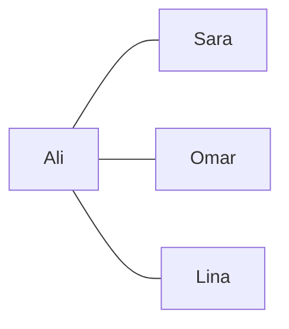

`frozenset({'ali_id', 'sara_id'})` equals
`frozenset({'sara_id', 'ali_id'})`. Therefore, one stored pair serves both users'
friend lists. `frozenset` itself does not enforce two members; the service rules
must prevent self-friendships and invalid records.

### Pending requests: ordered pairs

```python
pending_requests: set[tuple[str, str]] = set()
# Each tuple is (sender_id, receiver_id).
```

`('ali_id', 'sara_id')` means Ali sent Sara a request. The reverse tuple means a
different direction, so order matters here. The set prevents storing the exact
same tuple twice; the explicit checks also reject opposite-direction requests.

## 2. Current files and authentication

| File | Responsibility |
| --- | --- |
| `router.py` | Defines URLs, gets the authenticated user, calls friendship functions, converts errors into HTTP responses. |
| `memory_friends.py` | Holds the two sets and implements all friendship rules and storage changes. |
| `GUIDE.md` | Explains the current implementation and its flows. |

Files outside this folder also participate:

| File | Why friendship needs it |
| --- | --- |
| `authentication/current_user.py` | Validates authentication and returns the acting user. |
| `authentication/security.py` | Checks the access token, including expiry and session validity. |
| `authentication/memory_store.py` | Looks up existing accounts. |
| `main.py` | Registers `friends_router` with `app.include_router(friends_router)`. |

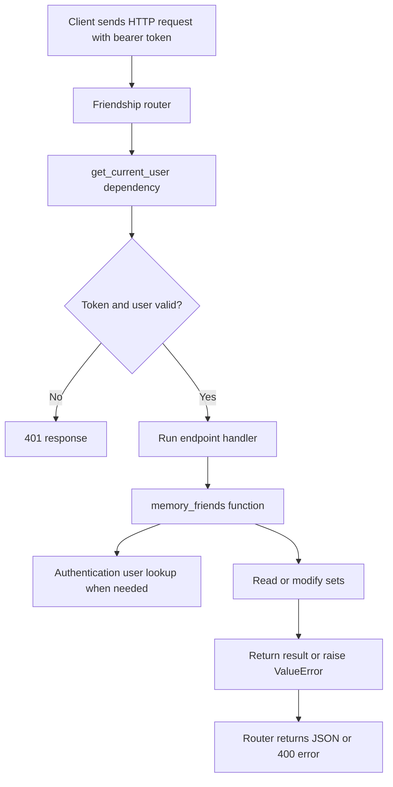

This alias is shorthand for an authenticated parameter:

```python
CurrentUser = Annotated[StoredUser, Depends(get_current_user)]
```

- `StoredUser` describes the user dictionary's keys for type checking.
- `Depends(get_current_user)` tells FastAPI to obtain that dictionary using the
  authentication function before calling the endpoint.
- `Annotated` attaches dependency information to the type.

The caller does not choose `current_user`. It comes from the token. URL IDs
identify the **other** participant. This is how Sara can accept her own incoming
request while Omar cannot accept it on her behalf.

`StoredUser` is a `TypedDict`, so access is `current_user['id']`, not
`current_user.id`. It is not a database model or a runtime response validator.

## 3. Current endpoints

These are the paths currently present in `router.py` on disk:

| Method and path | Acting user | Store function |
| --- | --- | --- |
| `GET /friends/` | Owner of the friend list | `get_friends(user_id)` |
| `GET /friends/requests` | Receiver of the requests | `get_incoming_requests(user_id)` |
| `POST /friends/request/{user_id}` | Sender | `send_friend(sender_id, receiver_id)` |
| `POST /friends/accept/{sender_id}` | Receiver | `accept_request(receiver_id, sender_id)` |
| `POST /friends/reject/{sender_id}` | Receiver | `reject_request(receiver_id, sender_id)` |
| `DELETE /friends/request/{receiver_id}` | Sender | `cancel_request(sender_id, receiver_id)` |
| `DELETE /friends/{friend_id}` | Either friend | `remove_friend(user_id, friend_id)` |

All current successful operations return 200. All explicitly raised friendship
`ValueError` exceptions become 400 responses. Authentication failures return
401. URL IDs currently have type `str`; these routes do not validate UUID syntax.

The current code has no outgoing-request listing endpoint.

## 4. Every current operation

### 4.1 Send a request

The router passes the authenticated user's ID as `from_user_id` and the URL ID
as `to_user_id`. `send_friend()` runs checks before modifying the set.

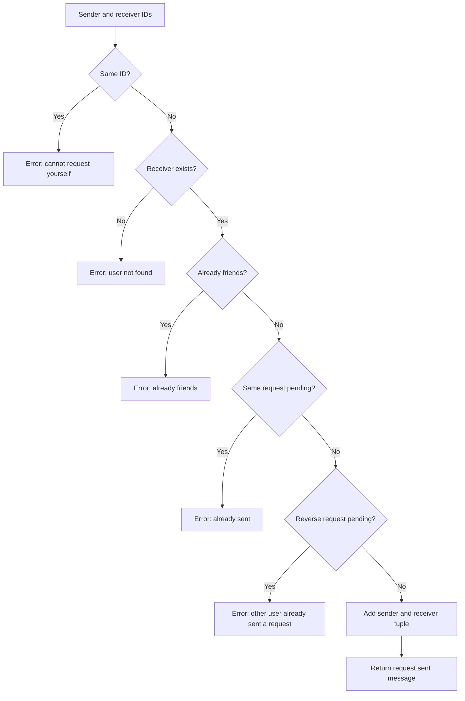

The sender's existence is assumed here because the router authenticated them.
Calling this store function directly bypasses that authentication assumption.

### 4.2 Accept a request

If Ali sent Sara a request, Sara calls the accept endpoint with Ali's ID.
The function parameters are `(receiver_id, sender_id)`, but the stored tuple is
always `(sender_id, receiver_id)`.

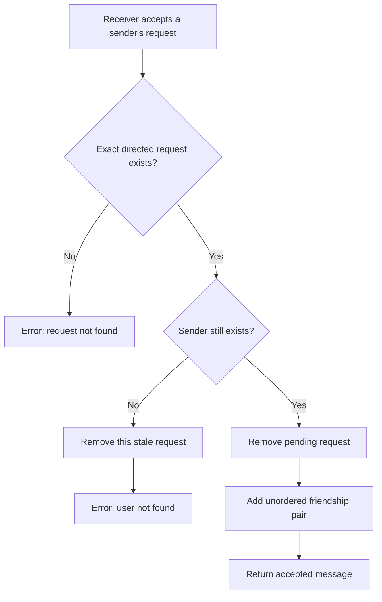

After acceptance, both users see the same friendship through their own list.
Accepting again fails because the pending request has already been consumed.

The deleted-sender check prevents creating a friendship with a nonexistent
account. In the current implementation, it removes only this pending request;
it is not comprehensive account-deletion cleanup.

### 4.3 Reject a request

Only the receiver can reject the corresponding incoming request.

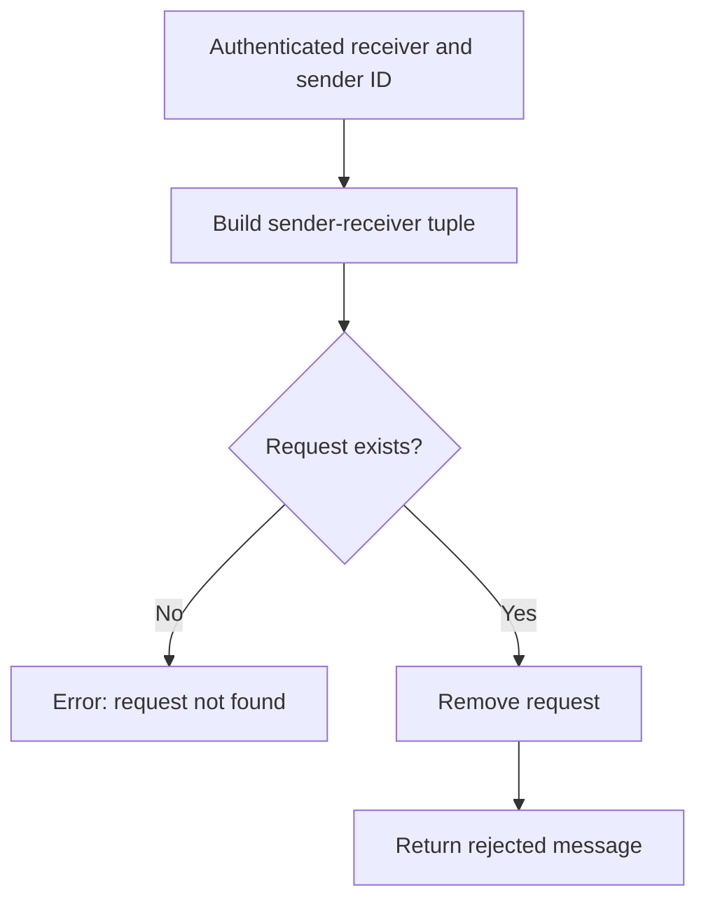

No friendship is created. The users may send a new request later.

### 4.4 Cancel a request

Only the sender can cancel the corresponding outgoing request.

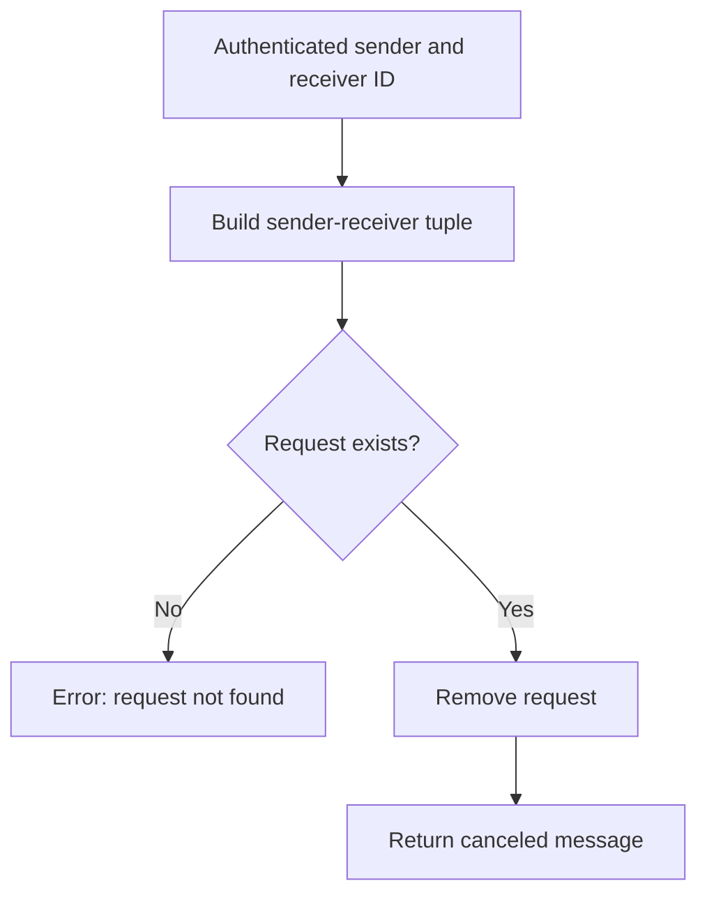

Reject and cancel modify the same data, but permission comes from different
participants. For Ali → Sara: **Sara rejects**, while **Ali cancels**.

### 4.5 Remove a friend

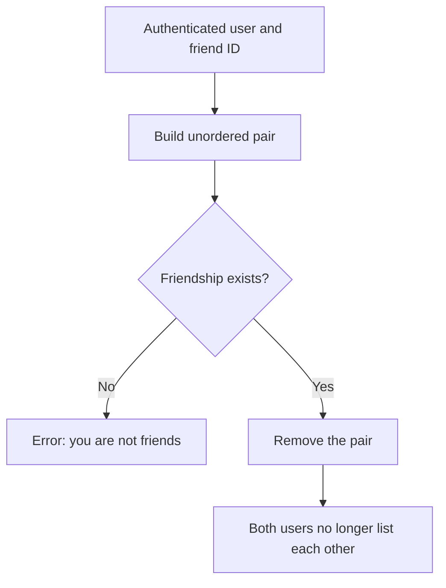

No second deletion is necessary: there was only one shared pair.
In the router, `memory_friends.remove_friend(...)` explicitly calls the store
function rather than the route handler with the same name.

### 4.6 List friends

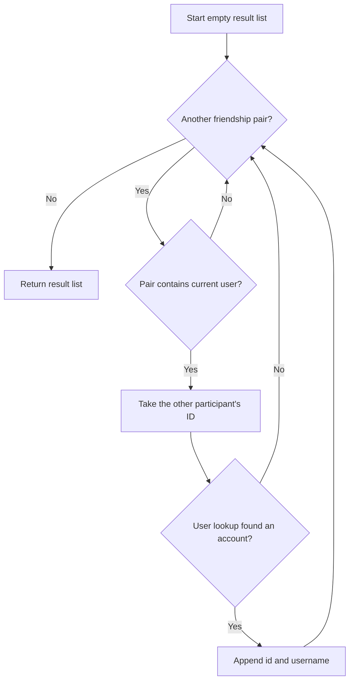

`continue` means skip the rest of the current loop iteration. It does not end
the function. Returning `[]` means the list is empty; it is not an error.

The current function skips deleted accounts but does not remove their stored
pairs. Output order is not specified because it iterates a set.

### 4.7 List incoming requests

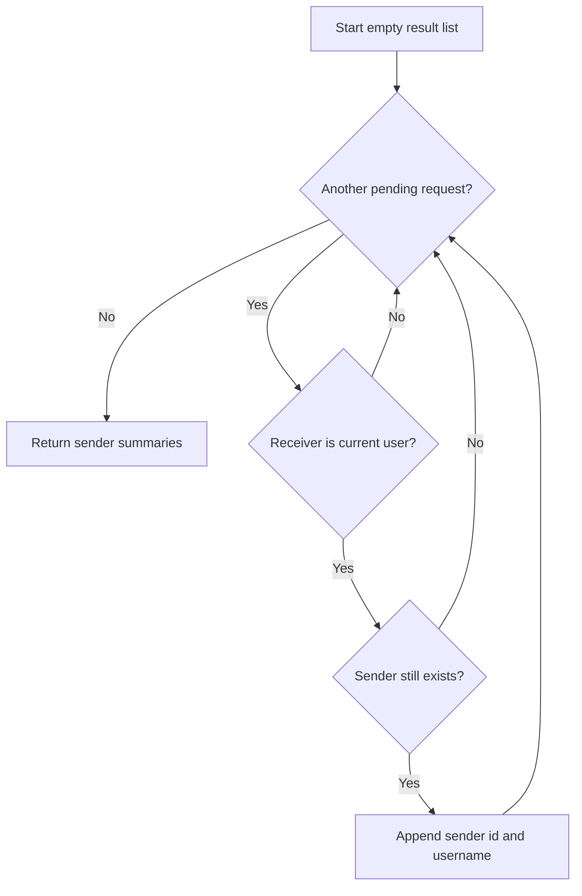

The current response contains sender summaries only. It does not contain the
receiver, a timestamp, or a separate request ID.

## 5. A complete example

For clarity, these are labels, not real UUIDs:

| Step | Pending requests | Friendships |
| --- | --- | --- |
| Initially | Empty | Empty |
| Ali sends Sara a request | `(Ali, Sara)` | Empty |
| Sara lists incoming requests | Unchanged | Empty |
| Sara accepts | Empty | `{Ali, Sara}` |
| Ali removes Sara | Empty | Empty |

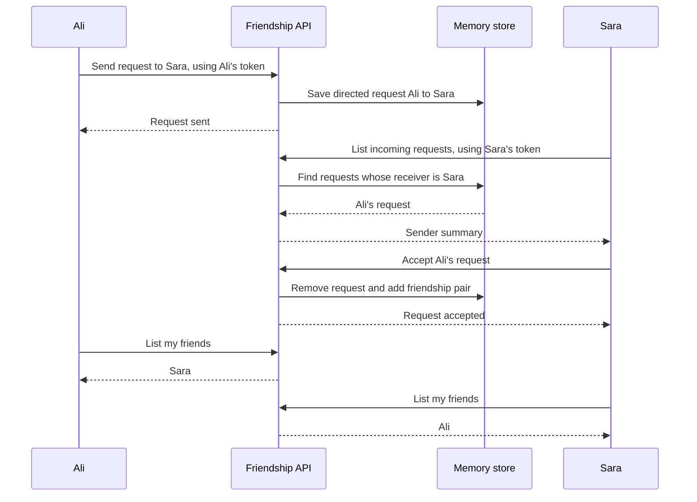

The API does not send a live notification in this sequence. Sara explicitly
fetches her incoming requests. WebSocket notifications are a separate feature.

## 6. Limitations of the current implementation

- Memory disappears on restart and is not shared between server workers.
- Business rules and storage are combined in `memory_friends.py`.
- Lists are unordered and requests have no timestamps.
- All domain errors are 400, so clients must inspect text to distinguish causes.
- Friendship routes directly use the authentication store's user type.
- There are no response models for friendship output and no UUID path validation.
- Account deletion needs cleanup of all related requests and friendships.
- There are no explicit transactions or locks in this version. Its synchronous
  store functions currently do not yield in one event loop, but that does not
  guarantee safety after adding awaited database calls or multiple workers.

## 7. Python concepts used here

### Importing a module versus importing a function

The router currently uses both styles:

```python
from friendship import memory_friends
from friendship.memory_friends import get_friends
```

The first imports the module, so you call `memory_friends.remove_friend(...)`.
The second imports a function directly, so you call `get_friends(...)`.
Both refer to the same module's storage when imported under this consistent
package path. Neither creates a fresh friendship store for each request.

The removal handler is itself named `remove_friend`. Calling bare
`remove_friend(...)` from inside it would refer to the handler, not the store
function. The module prefix avoids that naming collision.

### Exceptions and HTTP responses

The store raises a Python exception to report a rejected operation:

```python
raise ValueError("Friend request not found")
```

The handler catches that exception:

```python
try:
    accept_request(current_user["id"], sender_id)
except ValueError as error:
    raise HTTPException(status_code=400, detail=str(error)) from error
```

`raise` stops normal execution of the function. `str(error)` extracts its message.
`from error` preserves the original cause for debugging; it does not add another
successful response. FastAPI turns `HTTPException` into JSON such as:

```json
{"detail": "Friend request not found"}
```

The success message below the `try/except` is reached only if no exception was
raised. An unexpected exception not covered by this handler is a server error,
not automatically a 400.

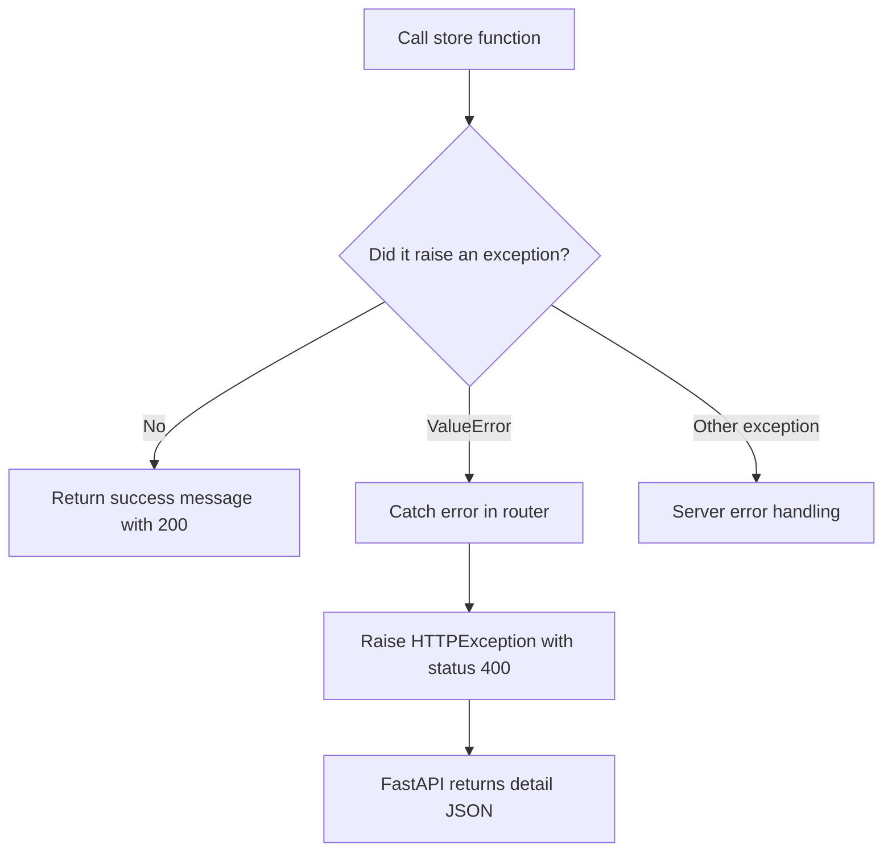

### Type hints

`user_id: str` documents an expected string. The annotation
`list[dict[str, str]]` means a list whose entries are dictionaries with string
keys and string values. Type hints help the editor; ordinary Python functions
do not automatically reject every wrong type at runtime.

FastAPI also reads endpoint annotations to parse request parameters. Because
these URL parameters are annotated `str`, they are not validated as UUIDs.

### `async def` and regular `def`

The routes are `async def` because they participate in FastAPI's asynchronous
request handling. The current storage functions are regular `def`: they perform
short in-memory operations and are called directly, without `await`.

Declaring a handler async does not make its storage persistent, transactional,
or automatically safe across multiple workers. When storage becomes async
database I/O, its calls will need an appropriate async interface and `await`.

## 8. Checking the features yourself

Start the backend with its configured environment. Open `/docs` at the backend's
address. Register Ali and Sara through authentication, save their returned IDs,
and log in to obtain each account's token. Use **Authorize** to switch the token
when switching actors.

Use real IDs in URLs; the placeholders below describe which ID to choose.

| Actor | Request | Expected result |
| --- | --- | --- |
| Ali | `POST /friends/request/{sara_id}` | Request sent, 200. |
| Sara | `GET /friends/requests` | Ali's ID and username appear. |
| Ali | `GET /friends/` | Still empty before acceptance. |
| Sara | `POST /friends/accept/{ali_id}` | Request accepted, 200. |
| Sara | `GET /friends/requests` | Empty. |
| Ali | `GET /friends/` | Sara appears. |
| Sara | `GET /friends/` | Ali appears. |
| Ali | `DELETE /friends/{sara_id}` | Friend removed, 200. |
| Both separately | `GET /friends/` | Empty. |

Then test rejection: Ali sends another request; Sara calls
`POST /friends/reject/{ali_id}`. Incoming requests disappear and no friendship
is created.

Then test cancellation: Ali sends another request; Ali calls
`DELETE /friends/request/{sara_id}`. Sara no longer sees the request.

### Errors and permission checks

| Case | Expected behavior in the current code |
| --- | --- |
| Missing or invalid token | 401. |
| Send to yourself | 400. |
| Send to a nonexistent user | 400. |
| Send the same request twice | Second request returns 400. |
| Sara sends Ali a request while Ali's request to Sara is pending | 400. |
| Send to an accepted friend | 400. |
| Accept, reject, or cancel a missing request | 400. |
| Remove someone who is not a friend | 400. |
| Ali tries to accept his outgoing request | 400; the reverse directed tuple does not exist. |
| Omar tries to accept Ali's request to Sara | 400; no Ali-to-Omar request exists. |
| Omar tries to remove Ali and Sara's friendship | 400; the operation can only refer to Omar's own pair. |

Malformed ID strings do not have a separate UUID-validation response here.
For example, sending to `not-a-uuid` reaches the user lookup and normally returns
400 because that ID is not found.

Test multiple friendships too: add Sara and Omar as Ali's friends, remove Sara,
and confirm Omar remains. Restarting the backend clears the temporary accounts
and relationships, so keep it running throughout a manual test sequence.

The deleted-sender case requires a controlled test that removes an account from
the user store after a request is sent. There is no account-deletion endpoint in
this friendship router. The receiver should then get a 400 error on acceptance,
and that stale pending request should be removed.

This guide documents expected behavior from reading the code. Writing the guide
is not a fresh execution of the API test suite.

## 9. Where to make changes

| What you want to change | Where to look |
| --- | --- |
| URL, HTTP method, or success message | `router.py` |
| How a store error becomes an HTTP response | The handler's `except ValueError` block in `router.py` |
| Rules for sending or accepting | Corresponding function in `memory_friends.py` |
| What a friend list contains | `get_friends()` in `memory_friends.py` |
| What incoming requests contain | `get_incoming_requests()` in `memory_friends.py` |
| How relationships are stored | `friendships` and `pending_requests` in `memory_friends.py` |
| Which user is logged in | Authentication's `get_current_user()` |
| Finding account details | Authentication's `find_user_by_id()` |
| Making the routes available in the app | `app.include_router(friends_router)` in `main.py` |

To follow the code, pick one URL in `router.py`, identify the authenticated actor
and the other user's ID, then read the called function in `memory_friends.py`.
Track whether it reads or changes `pending_requests`, `friendships`, or both.
