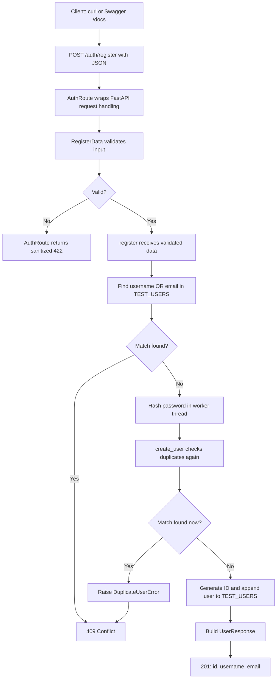
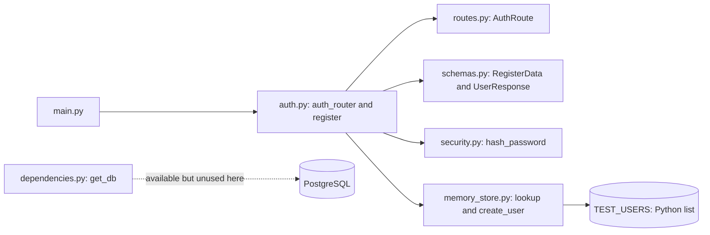
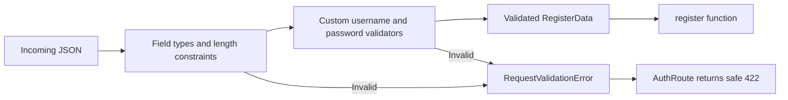
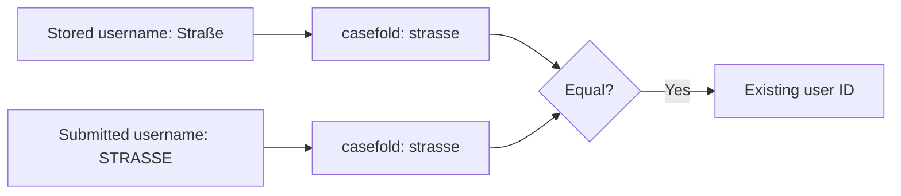
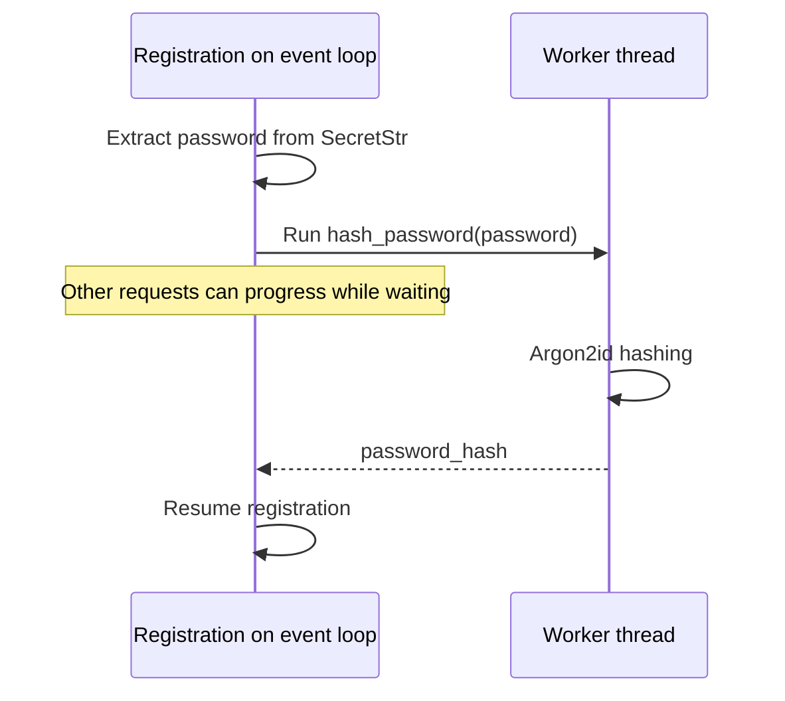
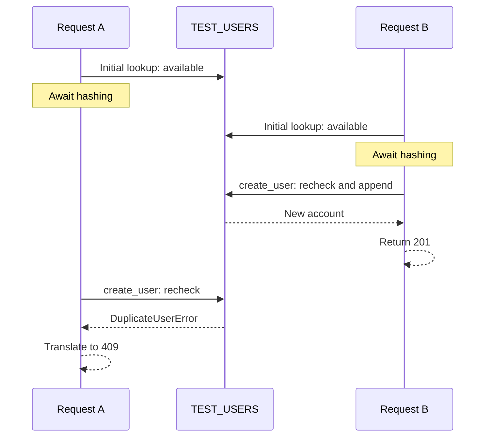
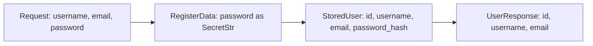

# Your registration architecture

This guide follows the code currently implemented in `backend/app/authentication/`, from an HTTP request to a registered user in temporary memory. It describes your existing work, including the functions that exist but are not called during registration.

## 1. What registration does today

A client sends JSON to **`POST /auth/register`**. FastAPI validates the fields, your endpoint rejects duplicate usernames or emails, hashes the password, stores the new user in `TEST_USERS`, and returns public user details with **201 Created**.

`TEST_USERS` is your intentional database simulation while your teammate builds the database. New users exist only in this server process and disappear on restart or reload. Registration currently performs no SQL query and writes no JSON file.



## 2. Where everything lives

Links below open the actual source files relative to this document.

| File | Responsibility | Used during registration? |
|---|---|---|
| [main.py](../backend/app/main.py) | Creates the FastAPI application and includes `auth_router` | Yes: connects the route to the app |
| [auth.py](../backend/app/authentication/auth.py) | Defines the router and coordinates registration | Yes |
| [routes.py](../backend/app/authentication/routes.py) | Defines `AuthRoute`, which sanitizes validation errors | Yes |
| [schemas.py](../backend/app/authentication/schemas.py) | Validates requests with `RegisterData`; defines public output with `UserResponse` | Yes |
| [security.py](../backend/app/authentication/security.py) | Hashes and verifies passwords | Hashing is used; verification is not called by registration |
| [memory_store.py](../backend/app/authentication/memory_store.py) | Looks up users and stores new accounts in a list | Yes |
| [dependencies.py](../backend/app/authentication/dependencies.py) | Provides an async SQLAlchemy session through `get_db()` | No: the current endpoint does not inject it |
| [test_registration.py](../backend/tests/test_registration.py) | Exercises registration, privacy, hashing, casefold matching, and concurrent duplicates | Tests only |



## 3. Input: JSON becomes RegisterData

Example request body:

```json
{
  "username": "Straße",
  "email": "newuser@example.com",
  "password": "ExamplePass123!xyz"
}
```

The client sends an HTTP request body. It does not need to create a `.json` file. FastAPI sees the `data: RegisterData` parameter and builds that model before calling `register()`.

| Field | Checks currently implemented |
|---|---|
| `email` | Required; `EmailStr` validates and normalizes the address; `Field` sets a maximum length of 256 |
| `username` | Required; 3–30 characters; starts with a letter; every character must be alphanumeric |
| `password` | Required; 15–128 characters; password policy requires uppercase, lowercase, a digit, a supported symbol, and no whitespace |

`EmailStr` checks address syntax, not ownership. The configured password library decides which characters count as symbols. Username `isalpha()` and `isalnum()` allow Unicode letters and numbers, including `ß` and Arabic letters.

### validate_username()

```python
if not username[0].isalpha() or not username.isalnum():
    raise ValueError(...)
return username
```

The field's length validation runs before this default after-validator. Empty usernames never reach `username[0]`. The function returns the original spelling when valid.

### validate_password_complexity()

```python
password_policy.validate(value.get_secret_value())
```

The password arrives here as a `SecretStr`. `get_secret_value()` supplies the real string to the policy checker. A failed rule raises `ValueError`; success returns the original `SecretStr`. This validator does not hash or save the password.



## 4. AuthRoute protects validation-error responses

`auth_router` is configured with `route_class=AuthRoute`. Its `get_route_handler()` obtains FastAPI's normal handler, wraps it with `safe_handler()`, and returns that wrapper.

The wrapper surrounds request validation as well as the endpoint call. Therefore it can catch errors that happen before `register()` starts.

When a `RequestValidationError` occurs, the wrapper keeps only:

- `loc`: which field failed;
- `type`: the validation error category;
- `msg`: the explanation.

It omits raw `input` and `ctx`. A missing-field error can contain the entire submitted object as its input, including the password, so sanitizing only password-field errors would not be sufficient.

Example response for a missing username:

```json
{
  "detail": [
    {
      "loc": ["body", "username"],
      "type": "missing",
      "msg": "Field required"
    }
  ]
}
```

This response has status **422**. The current validators use fixed explanations that do not embed submitted passwords. Future validators should preserve that property. `AuthRoute` does not convert duplicate-user `HTTPException`s into 422 responses; those remain 409.

## 5. find_existing_user_id(): duplicate lookup

This function receives a username and email and searches `TEST_USERS`. A match on **either** field is enough to block registration.

```python
user["username"].casefold() == username.casefold()
# OR
user["email"].casefold() == email.casefold()
```

| Result | Meaning | Endpoint action |
|---|---|---|
| An integer ID | Username or email already exists | Return 409 |
| `None` | Neither matches | Continue to hashing |

`casefold()` returns a new comparison string. It does not modify the stored value. Your present policy treats both usernames and complete email addresses case-insensitively.



Your current list stores only the original username; there is no stored `username_key` field. The function calculates comparison values during each lookup.

## 6. hash_password(): protect the stored password

`security.py` creates one reusable hasher:

```python
password_hasher = PasswordHash.recommended()
```

Your installed configuration uses Argon2id. `hash_password()` calls its `.hash()` method. The library generates the salt and includes the information required for later verification in the resulting string.

The endpoint calls it this way:

```python
password_hash = await run_in_threadpool(
    hash_password,
    data.password.get_secret_value(),
)
```

| Part | What it does |
|---|---|
| `SecretStr` | Masks normal display of the original value; it is not encryption |
| `.get_secret_value()` | Extracts the original password for hashing |
| `hash_password` | Produces the Argon2id hash |
| `run_in_threadpool` | Runs the synchronous hashing work in a worker thread |
| `await` | Lets this request wait without occupying the event loop with hashing |



`verify_password(password, password_hash)` also exists in `security.py`. It returns whether a supplied password matches a stored hash. Your registration route does not call it; the tests exercise it. No login route is implemented in this authentication flow.

## 7. create_user(): recheck and save

`create_user()` performs these steps synchronously:

1. Call `find_existing_user_id()` again.
2. Raise `DuplicateUserError` if either field is already used.
3. Generate the next ID using the largest current ID plus one.
4. Create a dictionary containing `id`, `username`, `email`, and `password_hash`.
5. Append it to `TEST_USERS` and return it.

Example stored shape; the hash below is only a placeholder:

```python
{
    "id": 2,
    "username": "Straße",
    "email": "newuser@example.com",
    "password_hash": "<Argon2id hash>",
}
```

`StoredUser` is a `TypedDict`: it describes this dictionary for editors and type checkers, not runtime validation. The hash is marked `NotRequired` because your original lookup fixture lacks one. Every account created by `create_user()` includes a hash.

### Why check duplicates twice?

The first check avoids unnecessary hashing for a known duplicate. While one request awaits hashing, another request can register the same details. The second check catches that situation.



`create_user()` has no `await` between checking and appending. In your current single event loop, another request cannot interrupt those steps. This guarantee does not extend to separate server processes or arbitrary threads modifying the list.

The store raises its own `DuplicateUserError`; the HTTP endpoint catches it and translates it into `409 Conflict`. This keeps HTTP response details out of the storage function.

## 8. UserResponse: send only public data

The endpoint constructs a `UserResponse` with three explicit fields. The route also declares `response_model=UserResponse`, so FastAPI validates and serializes that response.

```json
{
  "id": 2,
  "username": "Straße",
  "email": "newuser@example.com"
}
```

Status: **201 Created**. No password or password hash is included.



## 9. All three outcomes

| Condition | Status | Storage change |
|---|---|---|
| Input fails validation | 422 | No user added |
| Username or email matches an existing user, including the second check | 409 | No user added by that request |
| Valid input and both fields available | 201 | New user appended to `TEST_USERS` |

Duplicate response:

```json
{
  "detail": "Username or email is already registered."
}
```

## 10. Test the implemented flow

From the project root, start the backend:

```sh
make
```

In another terminal:

```sh
curl -i -X POST http://127.0.0.1:8000/auth/register \
  -H 'Content-Type: application/json' \
  -d '{"username":"GuideUser123","email":"guide@example.com","password":"ExamplePass123!xyz"}'
```

The first request returns 201 if those details are available. Repeat it to receive 409. Change the password to `Short1!` to receive 422 with sanitized validation details. Keep the server running between duplicate tests: reloads reset the list.

You can also use `http://127.0.0.1:8000/docs` and choose **POST /auth/register → Try it out**.

Run the existing automated tests from the project root:

```sh
cd backend
PYTHONPATH=app uv run python -m unittest discover -s tests -v
```

The six test methods cover successful storage and hashing, wrong-password verification, duplicates, invalid input, simultaneous duplicates, error-response privacy, and Unicode casefold matching with preserved spelling.

## 11. What is deliberately outside this implemented flow

- `get_db()` exists but registration does not use it. PostgreSQL integration is being handled separately.
- `verify_password()` exists, but registration does not log the user in or create a session.
- `TEST_USERS` is temporary development storage, not persistent storage.
- The original sample user is a duplicate-lookup fixture without a password hash. Newly registered accounts include their hashes.

These boundaries explain the current code; they are not additional features you need to understand to follow registration.
